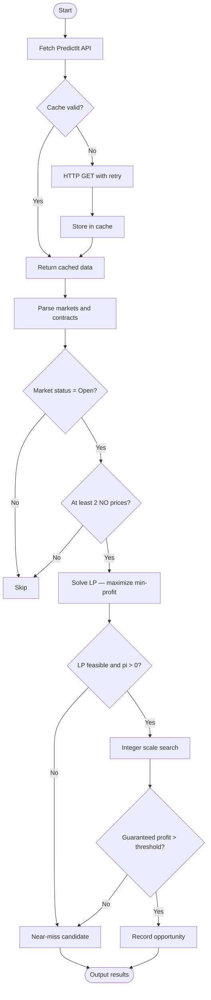
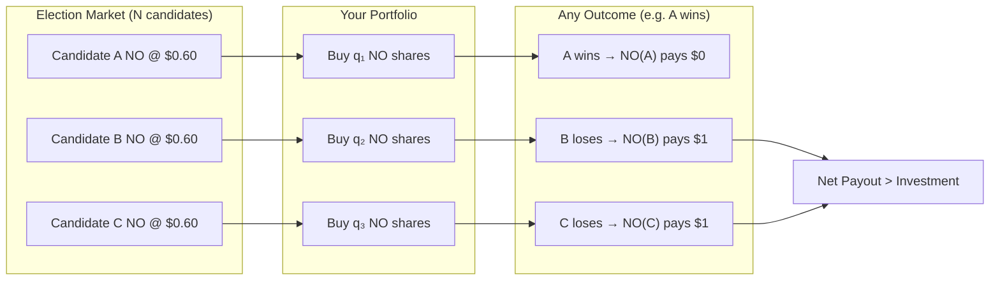
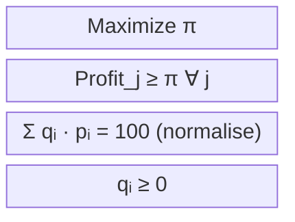
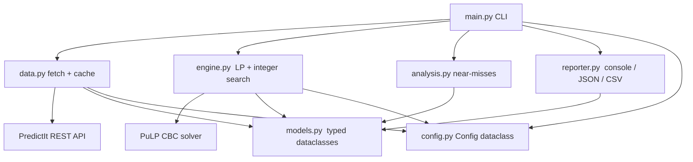

# PredictIt Arb Engine

A Python engine that scans [PredictIt](https://www.predictit.org) markets for risk-free arbitrage opportunities using linear programming.

## How It Works

In a mutually exclusive market with N candidates, exactly one wins. Buying "NO" on every candidate guarantees a payout from N-1 losing contracts. When the total cost of the NO portfolio is low enough, the net payout after fees exceeds the investment regardless of outcome.

### Arbitrage Detection Pipeline



### Buy-All-NO Strategy



### Fee Model

```
Gross payout per winning share  =  $1.00
Fee (10% of profit)             =  0.10 × (1 - price)
Net payout per winning share    =  1 - 0.10 × (1 - price)

Example at price $0.60:
  Net payout = 1 - 0.10 × 0.40 = $0.96
```

### LP Formulation



### Module Architecture



## Sample Output

```
Markets: 142 open / 148 total  |  Contracts: 891

============================================================
  Found 2 Arbitrage Opportunities
============================================================

[1] Who will win the 2026 Senate seat in Ohio?
    Strategy  : Buy All No
    Investment: $284.00
    Profit    : $16.40
    ROI       : 5.77%
    Orders:
      Buy   80 NO  'Candidate A'  @ $0.55  (cost: $44.00)
      Buy  107 NO  'Candidate B'  @ $0.75  (cost: $80.25)
      Buy  188 NO  'Candidate C'  @ $0.85  (cost: $159.80)
------------------------------------------------------------
```

## Setup

```bash
pip install -r requirements.txt
```

## Usage

**Live market scan:**

```bash
python main.py
```

**Offline demo (no network required):**

```bash
python demo.py
```

**CLI options:**

| Flag | Default | Description |
|------|---------|-------------|
| `--fee RATE` | `0.10` | Platform fee rate applied to profits |
| `--budget USD` | `850` | Maximum investment per opportunity in dollars |
| `--limit N` | `10` | Number of top opportunities to display |
| `--near-misses N` | `5` | Near-miss markets shown when no opportunities found |
| `--export-json PATH` | — | Export results to a JSON file |
| `--export-csv PATH` | — | Export results to a CSV file |
| `--no-cache` | off | Bypass the in-memory API response cache |
| `--timeout SECS` | `30` | API request timeout in seconds |
| `--retries N` | `3` | Maximum API retry attempts with exponential backoff |
| `--log-level LEVEL` | `WARNING` | `DEBUG` / `INFO` / `WARNING` / `ERROR` |

**Examples:**

```bash
python main.py --budget 500 --export-json results.json
python main.py --log-level INFO --near-misses 10
python main.py --no-cache --export-csv trades.csv
```

## Project Structure

```
predictit_arbitrage/
    config.py       Configuration dataclass with all tunable parameters
    models.py       Typed dataclasses — Contract, Market, TradeOrder, ArbitrageOpportunity, NearMiss
    data.py         API client with exponential-backoff retry and TTL caching
    engine.py       LP solver (PuLP CBC) and integer scale search
    analysis.py     Near-miss ranking and market summary statistics
    reporter.py     Console tables and JSON / CSV export
main.py             CLI entry point (argparse)
demo.py             Offline sample demo — no network required
```

## Limitations

- PredictIt's 10% fee significantly compresses margins; genuine arbitrage is rare in efficient markets.
- Trade execution is manual; prices may slip between scan time and order placement.
- PredictIt imposes an $850 position limit per contract.

